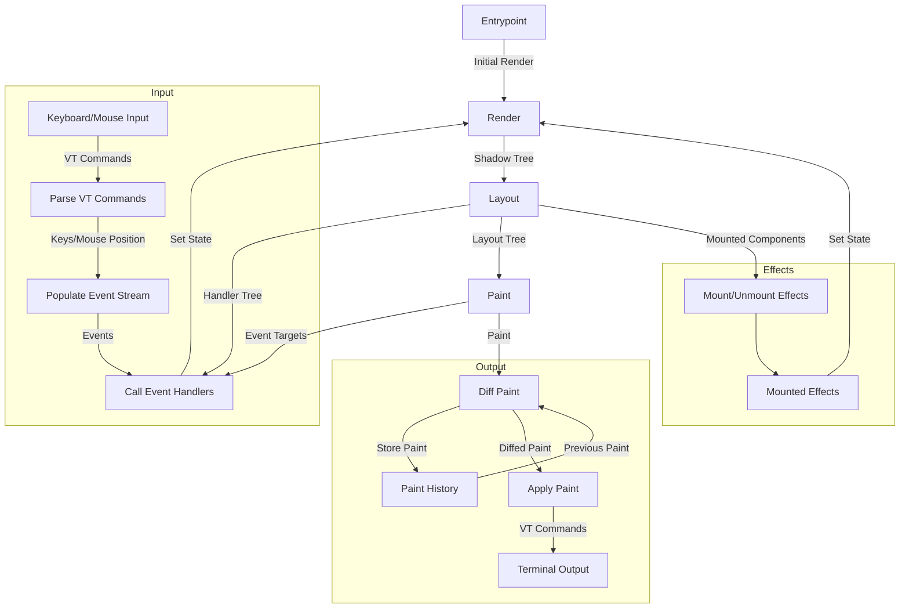

# App Flow

```mermaid
flowchart TB

    en[Entrypoint]
    r[Render]
    l[Layout]
    p[Paint]

    subgraph Output
        ph[Paint History]
        dp[Diff Paint]
        d[Apply Paint]
        t[Terminal Output]
    end

    subgraph Input
        i[Keyboard/Mouse Input]
        vp[Parse VT Commands]
        ev[Populate Event Stream]
        eh[Call Event Handlers]
    end

    subgraph Effects
        efm[Mount/Unmount Effects]
        eff[Mounted Effects]
    end

    en -- Initial Render --> r
    r -- Shadow Tree --> l
    l -- Layout Tree --> p
    p -- Paint --> dp

    ph -- Previous Paint --> dp
    dp -- Store Paint --> ph
    dp -- Diffed Paint --> d

    d -- VT Commands --> t

    i -- VT Commands --> vp
    vp -- Keys/Mouse Position --> ev
    ev -- Events --> eh
    l -- Handler Tree --> eh
    p -- Event Targets --> eh

    eh -- Set State --> r

    l -- Mounted Components --> efm
    efm --> eff
    eff -- Set State --> r

```
