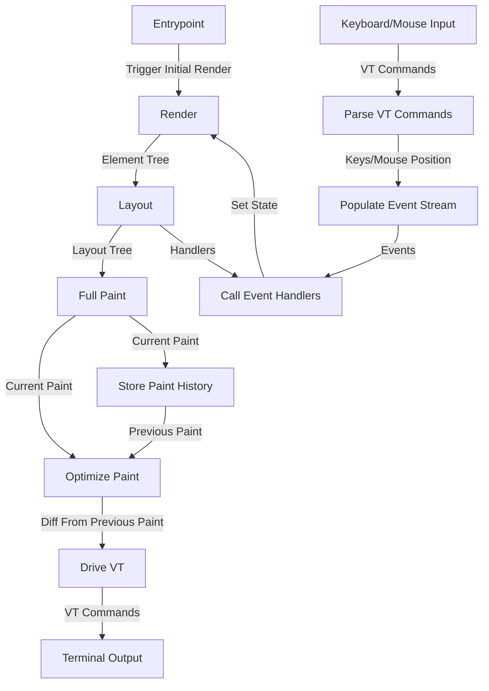

# App Flow

```mermaid
flowchart TB

    en[Entrypoint]
    r[Render]
    l[Layout]
    fp[Full Paint]
    ph[Store Paint History]
    op[Optimize Paint]
    d[Drive VT]
    t[Terminal Output]

    i[Keyboard/Mouse Input]
    vp[Parse VT Commands]
    ev[Populate Event Stream]
    eh[Call Event Handlers]

    en -- Trigger Initial Render --> r
    r -- Element Tree --> l
    l -- Layout Tree --> fp
    fp -- Current Paint --> op
    fp -- Current Paint --> ph
    ph -- Previous Paint --> op
    op -- Diff From Previous Paint --> d
    d -- VT Commands --> t

    i -- VT Commands --> vp
    vp -- Keys/Mouse Position --> ev
    ev -- Events --> eh
    l -- Handlers --> eh

    eh -- Set State --> r

```
