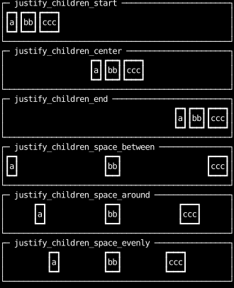
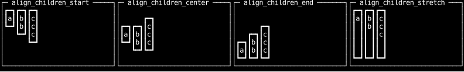
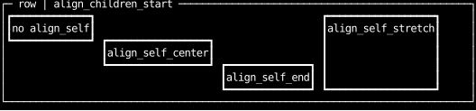
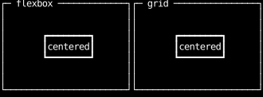
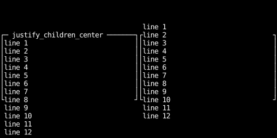

# Alignment and Distribution

A container places its children along two axes.
The `justify_children_*` utilities distribute them along the main axis
(across a `row`, down a `col`),
and the `align_children_*` utilities place them on the cross axis.
A child can override its parent's cross-axis alignment for itself with `align_self_*`.

The examples on this page title each panel with this helper,
which draws its text over the top border:

```python
--8<-- "layout_alignment.py:title"
```

## Distributing children along the main axis

The `justify_children_*` utilities share out the free space a row or column has left over
after its children take their sizes.
Children that grow leave no free space, so these only matter when nothing claims it.

```python
--8<-- "layout_alignment.py:justify"
```



## Aligning children on the cross axis

The default, `align_children_stretch`, fills the cross axis;
the others keep each child at its content size and place it.

```python
--8<-- "layout_alignment.py:align"
```



## Aligning one child

`align_self_*` on a child replaces its parent's `align_children_*` for that child alone.

```python
--8<-- "layout_alignment.py:align-self"
```



## Centering a box

With flexbox, center on both axes with `center_children`,
which is `justify_children_center | align_children_center`.
With grid, a lone child's cell fills the container,
so center it within its cell with `justify_items_center` and `align_children_center`.
To center a box over other content rather than among it, see
[A dialog centered over the app](layering.md#a-dialog-centered-over-the-app).

```python
--8<-- "layout_alignment.py:center"
```



## Content larger than its container

The `*_center` and `*_end` utilities are CSS's _safe_ alignments:
content too large for its container starts at the container's start edge
and overflows only past the end, so its beginning stays on screen.
Each has an `*_unsafe` counterpart with CSS's default behavior,
which centers or end-aligns the content anyway and overflows past the start edge too.

```python
--8<-- "layout_alignment.py:overflow"
```


