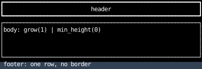
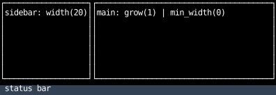
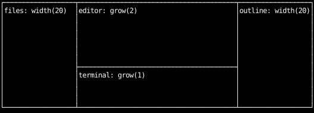

# App Shells

These whole-screen layouts combine the techniques from the other pages.
Each is a `full` root split with flexbox:
fixed parts take a size or their content's size, and the part that fills takes `fill(1)`
(see [Splitting space](splitting-space.md) for the same splits with grid).

## Header, body and footer

The header and footer take their content's height, and the body takes the rest.

```python
--8<-- "layout_shells.py:header-body-footer"
```



## Sidebar, main pane and status bar

A row that grows inside a column holds the sidebar and the main pane,
and the status bar takes one row below them.

```python
--8<-- "layout_shells.py:sidebar-status"
```



## Three panes

Fixed panes on both sides, and a middle column split 2:1 between two panes.
`border_collapse` on both containers makes neighbors share their borders.

```python
--8<-- "layout_shells.py:three-panes"
```



## A dialog over the app

See [A dialog centered over the app](layering.md#a-dialog-centered-over-the-app).
