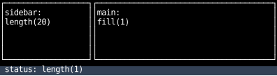
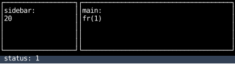
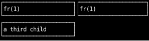
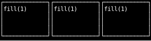
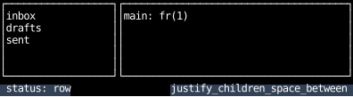
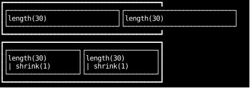

# Choosing a Layout Model

The other pages in this section show how to get each effect with flexbox and with grid.
This one helps you decide which of the two to use for a container.

## Who owns the sizes

Flexbox and grid can build most of the same layouts.
What differs is where the sizes are written.
In a grid, the parent lists them as track templates, and the children fill the tracks in order.
In flexbox, each child carries its own size, and the parent only sets the direction.
In short, grid is top-down and flexbox is bottom-up.

Here is one app shell built both ways, with the same result:

=== "Flexbox"

    ```python
    --8<-- "layout_choosing.py:shell-flex"
    ```

    

=== "Grid"

    ```python
    --8<-- "layout_choosing.py:shell-grid"
    ```

    

So choose by which should own the sizes: the container, or each child.

## Flexbox or grid?

Use **grid** when the container owns the arrangement:
a fixed set of slots known up front, such as an app shell or a dashboard,
or columns that must line up across rows.

Grid costs locality.
A child's size lives on its parent, away from the component that draws it,
and children fill the tracks in order, so a child the template didn't plan for
starts a new implicit row, and the rows split the height between them.
A flexbox row takes the same extra child as one more column.
[Auto flow](grids-and-wrapping.md#auto-flow) shows how grid adds the tracks.

=== "Grid"

    ```python
    --8<-- "layout_choosing.py:extra-child-grid"
    ```

    

=== "Flexbox"

    ```python
    --8<-- "layout_choosing.py:extra-child-flex"
    ```

    

Use **flexbox** when each child owns its size:
a variable number of children (lists, toolbars, tags), content-sized items, wrapping,
or a component that keeps its size wherever it's placed,
such as a sidebar that's always `length(24)`.

Flexbox costs alignment across rows:
two rows' columns line up only if each child in them repeats the same size.
In a grid they line up for free, as in [Dashboard tiles](grids-and-wrapping.md#dashboard-tiles).

## Mixing them

The choice is per container, not per app.
Any child of a grid can be a flexbox container, and any flexbox child can be a grid.
A common split for a terminal app is a grid for the screen,
whose panes are a fixed set known up front,
and flexbox inside each pane, for the lists, toolbars and status items whose number varies.
Here the grid places the panes, the sidebar is a `col` of items,
and the status bar is a `row` that pushes its items to either end:

```python
--8<-- "layout_choosing.py:mixed"
```



## Coming from ratatui?

[Ratatui](https://ratatui.rs/) splits an area by a list of constraints on the parent,
and never lets content push back: it hands each widget a rectangle to draw into.
Grid with `fr` tracks has the same structure,
and the [constraint utilities](splitting-space.md) give the same sizes in flexbox,
with each child holding its own constraint.
A few things behave differently.

Conflicts overflow instead of giving way.
Ratatui shrinks lower-priority constraints until the areas fit inside the parent,
so `Length(30)` twice in 40 cells comes out 20 and 20.
Flexbox has no priorities, and the constraint utilities don't shrink,
so `length(30)` twice overflows, as in the top row below.
Decide which child gives way and say so:
`shrink(1)` lets a `length` shrink below its basis, as on both children in the bottom row,
and `fill(1)` takes whatever is left, or nothing.

```python
--8<-- "layout_choosing.py:conflict"
```



Percentages don't subtract gaps.
Ratatui takes `spacing` out of the area first; a CSS percentage is a share of the whole parent,
so [two halves and a gap overflow](splitting-space.md#percentages-and-gaps).
Use `fill(1)` for equal shares.

`Flex::Legacy`, which gives leftover space to the last constraint, has no counterpart.
Put `grow(1)` on the child that should take it.
The other `Flex` modes are the `justify_children_*` utilities of the same names,
and ratatui's full-size cross axis is flexbox's default stretch
(see [Alignment and distribution](alignment.md)).
