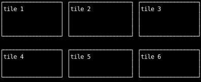
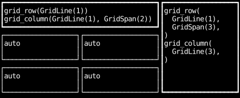
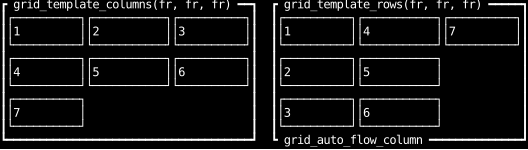
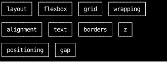

# Grids and Wrapping

`display_grid` lays a container's children out in rows and columns at once.
The container lists its tracks with `grid_template_columns` and `grid_template_rows`,
and each child fills the next free cell, or the cells it asks for.
The examples on this page share one track size, `fr = waxy.Fraction(1)`.

## Dashboard tiles

Equal tracks on both axes give a grid of equal tiles, and `gap` separates them.

```python
--8<-- "layout_grids.py:tiles"
```



## Cells spanning tracks

`grid_column` and `grid_row` place a child by grid line, counted from 1,
and `waxy.GridSpan(n)` stretches it across `n` tracks.
Children without a placement fill the cells that are left, in order.

Place a spanning child on both axes, as both are here.
A child placed on rows alone is placed before one placed on columns alone,
whatever their order among the children,
so mixing the two can push a child into an extra row below the template.

```python
--8<-- "layout_grids.py:spans"
```



## Auto flow

Children beyond the template's cells get new tracks, which the grid adds as it needs them.
By default, children fill each row in turn and the grid adds rows,
like the seventh child on the left.
`grid_auto_flow_column` fills each column in turn and adds columns instead.

```python
--8<-- "layout_grids.py:auto-flow"
```



## Wrapping without a grid

When children have different sizes and there's no grid for them to line up in,
`flex_wrap` lets a row start a new line when the next child doesn't fit.
`gap_width` spaces the children within a line.

```python
--8<-- "layout_grids.py:wrap"
```


