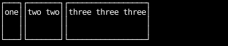
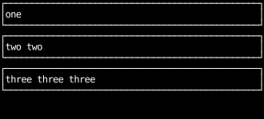
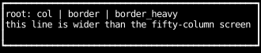
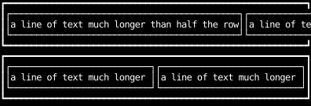
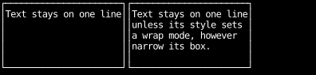

# How Layout Sizes Things

Counterweight lays out elements with [Taffy](https://github.com/DioxusLabs/taffy),
which implements CSS flexbox and grid with their CSS defaults:

- `flex_direction` is row.
- `flex_grow` is 0, so children don't grow into free space on the main axis.
- `flex_shrink` is 1, so children shrink when they don't fit.
- `align_items` is stretch, so children fill their parent on the cross axis.
- Sizes are border-box: a `width` includes the border and padding.

Together, these mean a child takes its content's size along its parent's direction,
and its parent's full size across it.

## Children take their content size along the main axis

In a `row`, each child is as wide as its content and as tall as the row:

```python
--8<-- "layout_defaults.py:row"
```



The space to the right is free space that no child claimed.
[Splitting space](splitting-space.md) shows how to hand it out.

## Children stretch across the cross axis

In a `col`, the axes swap: each child is as tall as its content and as wide as the column.

```python
--8<-- "layout_defaults.py:col"
```



Stretching is the default, so `align_children_stretch` never needs to be written out.
[Alignment and distribution](alignment.md) shows the alternatives.

## The root fills the screen

The app places the root component in a grid cell the size of the terminal,
and the root stretches to fill it, whatever its content.
Content wider than the terminal can't widen the root:
the wide line is cut off at the root's border.

```python
--8<-- "layout_defaults.py:root"
```



## Content sets a minimum size

A flex item can't shrink below its content's minimum size,
which CSS calls the automatic minimum size.
For a `Text` that doesn't wrap, that minimum is the whole line.
In the top row below, two `grow(1)` children with long lines can't take half the row each,
so they overflow it.

`min_width(0)` replaces the automatic minimum with zero,
so in the bottom row the same two children split the row evenly, and their text is cut off instead.
In a `col`, the same fix is `min_height(0)`.

```python
--8<-- "layout_defaults.py:automatic-minimum"
```



## Text doesn't wrap unless asked to

A `Text` renders each line of its content on one row, and cuts it off at the edge of its box.
Setting a wrap mode such as `text_wrap_stable` breaks lines to fit the box's width instead.
[Text wrapping](../styles/text-wrapping.md) compares the wrap modes.

```python
--8<-- "layout_defaults.py:wrapping"
```


