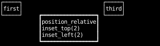
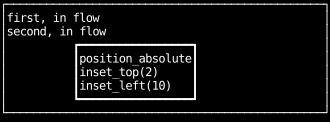
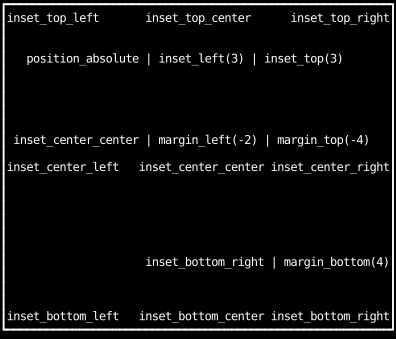
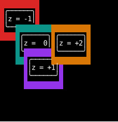
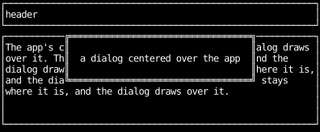

# Layering

Most boxes sit where layout puts them, side by side.
Positioning moves a box off that spot, so it can overlap others,
and `z` decides which of the overlapping boxes is drawn on top.

## Relative positioning

`position_relative` with insets moves a box from where layout placed it,
without moving anything else: its siblings keep the space it would have taken.
Insets are measured in cells, and `inset_top(2)` moves the box down two rows.

```python
--8<-- "layout_layering.py:relative"
```



## Absolute positioning

`position_absolute` takes a box out of the flow:
its siblings are laid out as if it weren't there,
and its insets place it relative to its parent's padding box.

```python
--8<-- "layout_layering.py:absolute"
```



## Placing a box at an edge or corner

The `inset_*` utilities position a box absolutely at one of nine places in its parent.
Their `center` axes leave the insets on that axis unset,
which leaves the box where its parent's alignment puts it,
so they center only in a parent that centers its children, as this one does.
Margins push the box away from where it was placed.

```python
--8<-- "absolute_positioning_insets.py:example"
```



## Controlling overlap with `z`

Where boxes overlap, the one with the higher `z` is drawn on top.
Boxes with equal `z` are drawn in the order they appear.

```python
--8<-- "z.py:example"
```



## A dialog centered over the app

To draw a box over the rest of the app, put it inside an absolutely positioned overlay
whose insets of 0 stretch it over its whole parent,
and let the overlay center the box with ordinary alignment.
The overlay has no border, padding or margin, so it draws nothing itself,
and the app's content shows around the dialog.
The dialog is drawn over the content because it comes after it;
a dialog that comes earlier in the tree needs a higher `z`.

```python
--8<-- "layout_layering.py:dialog"
```



## A badge pinned to a corner

Negative insets reach past the parent's padding box onto its border.
`inset_top(-1)` puts a box on the top border, and `inset_right(-1)` on the right border.

```python
--8<-- "layout_layering.py:badge"
```


