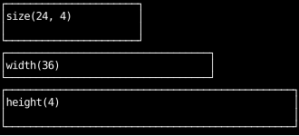
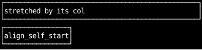
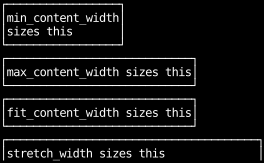
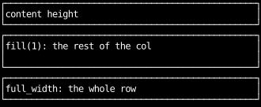
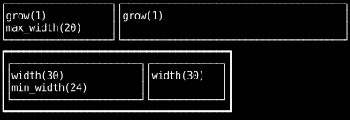
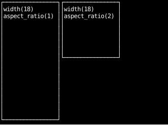
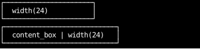

# Sizing One Box

A box's size comes from its parent unless it sets its own:
along the parent's main axis it takes its content size, and across it it stretches
(see [How layout sizes things](how-layout-sizes-things.md)).
The utilities on this page override either.

## A fixed size

`width`, `height` and `size` set a box's size in cells.
An axis left unset keeps its default: the `height(4)` box below still stretches across the column.

```python
--8<-- "layout_box_sizing.py:fixed"
```



## Fit to content

Along the main axis, a box already fits its content.
Across it, a box stretches unless its alignment says otherwise:
`align_self_start` (or any alignment except stretch) shrinks it to its content.

```python
--8<-- "layout_box_sizing.py:fit"
```



## Sizing keywords

The sizing keywords set a box's width or height from its content, whichever axis it is on:

- `min_content_width` is as narrow as the content goes without breaking a word:
  for wrapping text, its widest word.
- `max_content_width` is as wide as the content is unwrapped.
- `fit_content_width` is the max-content width, capped at the space available
  (but never below the min-content width), as a wrapping paragraph is in CSS.
  It differs from `max_content_width` only when the content doesn't fit.
- `stretch_width` fills the space available, after the box's margins.

Each has a `_height` counterpart.
In a `col`, taffy measures a box's height before applying a width keyword,
so wrapping text with `min_content_width` keeps the height it would have had stretched,
and its last lines are cut off.
In a `row` or a grid, the keywords size wrapping text correctly.

```python
--8<-- "layout_box_sizing.py:content-keywords"
```



## Fill the parent

`grow(1)` fills the free space along the main axis, after the other children take theirs.
`full_width` and `full_height` (the same as `stretch_width` and `stretch_height`) fill the parent,
after the box's margins, whatever the other children need.

```python
--8<-- "layout_box_sizing.py:fill"
```



## Clamped with minimum and maximum sizes

`max_width` and `max_height` cap a box that would otherwise grow;
`min_width` and `min_height` stop one shrinking.
In the top row, the first box would take half the row but stops at 20 cells.
In the bottom row, two 30-cell boxes don't fit in 40 cells, so both shrink,
but the first stops at 24 cells and the second gives up the rest.

```python
--8<-- "layout_box_sizing.py:clamped"
```



## Aspect ratio

`aspect_ratio` sets a box's width divided by its height,
so a box with a width and an aspect ratio gets its height from them.
Terminal cells are about twice as tall as they are wide,
so `aspect_ratio(1)` looks tall, and `aspect_ratio(2)` is the one that looks square.
The parent here sets `align_children_start`:
a box stretched across a row has its height from the row, and its aspect ratio has nothing to set.

```python
--8<-- "layout_box_sizing.py:aspect-ratio"
```



## Border box and content box

Sizes include the border and padding by default, so a `width(24)` box is 24 cells wide overall.
With `content_box`, the size applies to the content alone,
and the border and padding are added outside it: here 24 cells of content, 4 of padding and 2 of border.

```python
--8<-- "layout_box_sizing.py:box-sizing"
```


