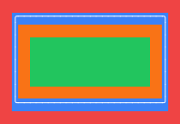
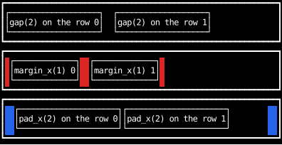
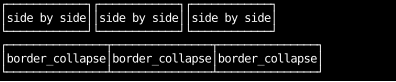
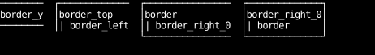
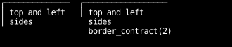

# Spacing and Borders

## The box model

Counterweight's layout follows the
[CSS box model](https://developer.mozilla.org/en-US/docs/Learn/CSS/Building_blocks/The_box_model).
Every element's box is four nested rectangles:

- **Content**: where the element's content goes.
  A [`Div`'s][counterweight.elements.Div] content is its children,
  and a [`Text`'s][counterweight.elements.Text] content is its text.
- **Padding**: space between the content and the border.
- **Border**: the box-drawing characters around the padding.
- **Margin**: space between the border and the element's neighbors.

The example below colors each rectangle:

```python
--8<-- "box_model.py:example"
```



!!! tip "Terminal cells are not square"

    Terminal cells are about twice as tall as they are wide,
    so one row of vertical padding or margin looks about as big as two columns of horizontal.
    The example above uses twice as much horizontal spacing as vertical for that reason,
    and horizontal spacing alone is often enough.

## Gap, margin and padding

All three put space around children, but they belong to different elements:

- `gap` is set on the parent, and puts space _between_ its children only.
- `margin` is set on a child, and puts space all around it, including at the ends of the row.
  Margins don't collapse into each other, so two children with `margin_x(1)` are two cells apart.
- `pad` is set on the parent, and puts space between its border and all of its children.

`margin_color` and `padding_color` color the margin and padding, in red and blue here.

```python
--8<-- "layout_spacing.py:gap-margin-pad"
```



## Sharing borders between neighbors

`border_collapse` on a parent overlaps its children's borders by one cell,
so neighbors share a border instead of drawing two side by side.
Where the shared borders meet, [border healing](../cookbook/border-healing.md)
joins them with the right junction characters.

```python
--8<-- "layout_spacing.py:collapse"
```



## Borders on some sides

Borders work as they do in Tailwind.
A side is drawn where its border width is 1, and layout reserves a cell for it.
`border` sets all four sides, `border_top`, `border_bottom`, `border_left` and `border_right`
set one, and `border_x` and `border_y` set a pair.
Each has a `_0` form, such as `border_right_0`, that takes its sides away.
Sides start at 0, so `border_top | border_left` draws just those two.

Merging is ordered, as it is for every style: the right side wins.
`border | border_right_0` leaves the right side off,
but `border_right_0 | border` turns it back on.

The border kind only chooses the characters, and defaults to `BorderKind.Light`,
so `border` alone draws a light border and `border | border_heavy` a heavy one.
A kind with no widths draws nothing.
`border_none` removes the border along with its space.
`border_sides` sets all four sides at once from a set of side names.

```python
--8<-- "layout_spacing.py:sides"
```



## Shortening edges next to missing sides

`border_contract(n)` stops each edge `n` cells short at an end next to a side that isn't drawn.

```python
--8<-- "layout_spacing.py:contract"
```


