# Splitting Space

Each split on this page can be built two ways.
With flexbox, each child carries its own share.
With grid, the parent lists the shares as track sizes,
and children fill the tracks in order.
Both give the same screenshot.

The flexbox versions use the constraint utilities,
named after the constraints [ratatui](https://ratatui.rs/) splits an area with:

| Utility         | The child takes                          |
| --------------- | ---------------------------------------- |
| `length(n)`     | `n` cells                                |
| `percentage(p)` | `p` percent of the parent                |
| `ratio(a, b)`   | `a / b` of the parent                    |
| `fill(n)`       | `n` shares of the space the others leave |

Each acts along its parent's main axis, so the same utility works in a `row` and in a `col`,
and none of them lets content push a child past its share.
They are ordinary `Style`s, so you can override one part and keep the rest:
`length(20) | grow(1)` takes 20 cells and then a share of whatever is left,
and `fill(1) | min_width(15)` fills but never gets narrower than 15 cells.

The grid versions list the same constraints as track sizes:
a plain `int` is that many cells, and `fr(n)` is `n` shares of the space the others leave.

## Equal shares

=== "Flexbox"

    ```python
    --8<-- "layout_splitting.py:equal-flex"
    ```

    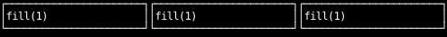

=== "Grid"

    ```python
    --8<-- "layout_splitting.py:equal-grid"
    ```

    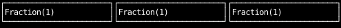

`fill(1)` starts every child from nothing, whatever its content,
so the whole row is shared out by the fill factors.

## A fixed sidebar beside a filling pane

=== "Flexbox"

    ```python
    --8<-- "layout_splitting.py:sidebar-flex"
    ```

    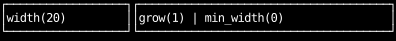

=== "Grid"

    ```python
    --8<-- "layout_splitting.py:sidebar-grid"
    ```

    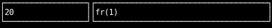

## Ratios

Fill factors and fractions divide the space in proportion,
so `1` and `2` give the second pane twice the width of the first.

=== "Flexbox"

    ```python
    --8<-- "layout_splitting.py:ratio-flex"
    ```

    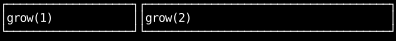

=== "Grid"

    ```python
    --8<-- "layout_splitting.py:ratio-grid"
    ```

    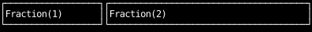

=== "Flexbox with `ratio`"

    ```python
    --8<-- "layout_splitting.py:ratio-exact"
    ```

    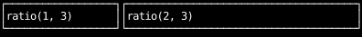

`fill` divides only the space left after each pane's own border,
which a flex item can't shrink below,
so its panes come out a cell away from an exact 1:2 split.
Grid divides the whole width between the tracks first, and the borders go inside them.
`ratio` and `percentage` are shares of the whole width too,
so they split it exactly when you know every share up front.

## Nested splits

With flexbox, a split inside a split is a container inside a container:
here a `col` that fills the rest of the row, split in turn between two children.
`fill` works on the column's vertical axis just as it does on the row's horizontal one.
With grid, one parent can hold both axes,
and a child spans tracks to cover the space a nested container would have.

=== "Flexbox"

    ```python
    --8<-- "layout_splitting.py:nested-flex"
    ```

    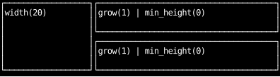

=== "Grid"

    ```python
    --8<-- "layout_splitting.py:nested-grid"
    ```

    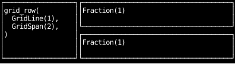

## Content wider than its share

A bare `waxy.Fraction` track has the same floor as a flex item:
it is never narrower than its content's minimum size.
In the top grid below, two lines of unwrapped text push their columns past the grid's edge.
`fr(1)` is CSS's `minmax(0, 1fr)`, which lowers the floor to zero,
so in the bottom grid the columns split the space and the text is cut off instead.

```python
--8<-- "layout_splitting.py:overflow-grid"
```

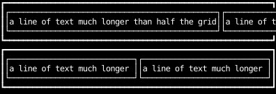

For the flexbox version of the same failure,
see [Content sets a minimum size](how-layout-sizes-things.md#content-sets-a-minimum-size).

## Percentages and gaps

A percentage is a share of the parent's whole content box, and gaps aren't subtracted first,
so two halves and a gap don't fit.
`percentage` doesn't shrink, so in the bottom row the halves keep their size
and overflow the row by the width of the gap.
With `shrink(1)`, as in the top row, each half gives up one cell to the gap instead.
To split a row with gaps into equal shares, use `fill` as in [Equal shares](#equal-shares).

```python
--8<-- "layout_splitting.py:percent-gap"
```

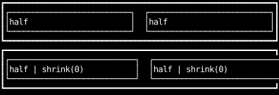
