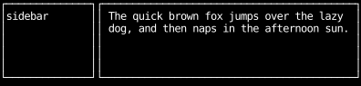
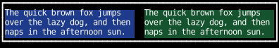
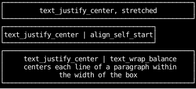

# Text in Layout

A `Text` is sized by measuring its content:
unwrapped, it is as wide as its longest line;
with a wrap mode, its height is the number of lines its content wraps to at the width it gets.
Content that doesn't fit is cut off at the edge of the `Text`'s own box.
[Text wrapping](../styles/text-wrapping.md) compares the wrap modes themselves.

## Wrapping inside a pane

A wrapping `Text` in a column is stretched to the column's width,
and wraps to fit it, taking as many rows as it needs.

```python
--8<-- "layout_text.py:wrap-in-pane"
```



## Wrapping beside other text

Wrapping `Text`s side by side in a row shrink to share it, and each wraps to its share.
A flex item can't shrink below its minimum size,
and a wrapping `Text`'s minimum size is the width of its widest word,
so neither needs anything set to give up the space its unwrapped line would take.

```python
--8<-- "layout_text.py:wrap-in-row"
```



## Justification needs room

`text_justify_center` and `text_justify_right` align each line within the `Text`'s own width.
A `Text` stretched across its parent has room to move its lines,
but one sized to its content, like the `align_self_start` one below, has none.
With a wrap mode, each line is aligned separately.

```python
--8<-- "layout_text.py:justify"
```



## Long unwrapped text in a narrow pane

In a `col`, a `Text` is stretched to the column's width, however long its content,
and the content is cut off at the `Text`'s edge.
In a `row`, a `Text` is as wide as its content, so it overflows the row's border.
Give it `min_width(0)` to keep it inside the row,
or a wrap mode to break its lines instead.

```python
--8<-- "layout_text.py:narrow"
```


