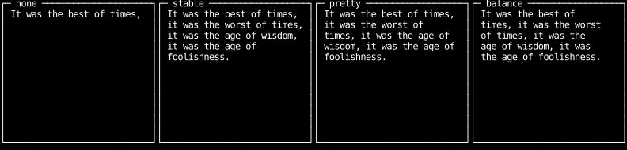

# Text Wrapping

By default, `Text` elements render their content on a single line.
When the content is wider than the available space, it overflows rather than wrapping.
Use the `text_wrap_*` style utilities to control how long text is broken across lines.

## Wrap Modes

Counterweight supports four wrap modes, illustrated below with the same paragraph of text:

```python
--8<-- "text_wrap.py:example"
```



### `text_wrap_none` (default)

No wrapping. The text renders as a single line regardless of the available width.
Content that exceeds the container width is clipped.

### `text_wrap_stable`

Greedy line-breaking — fills each line as much as possible before starting the next.
This is the fastest algorithm and produces consistent, deterministic output.
Use it when performance matters or when you want predictable line breaks.

### `text_wrap_balance`

Attempts to make all lines roughly equal in length by binary-searching for the narrowest
target width that doesn't increase the total line count.
Useful for headings and short paragraphs where visual balance is more important than
filling lines to the edge.

### `text_wrap_pretty`

Dynamic-programming line-breaking ([Knuth–Plass](https://en.wikipedia.org/wiki/Knuth%E2%80%93Plass_line_breaking_algorithm) style) that minimises the sum of squared
slack on non-final lines.
This produces typographically "nicer" output than greedy wrapping — shorter lines near
the end of a paragraph are avoided — at the cost of slightly higher CPU usage for very
long texts.

---

## Layout

A wrapping `Text` wraps to the width layout gives it.
In a column that width comes from the column, since children stretch across it by default.
Side by side in a row, wrapping `Text`s need `min_width(0)` before they will shrink and wrap,
because their minimum size is their unwrapped width.
[Text in layout](../layout/text.md) shows both cases.

---

## Long Words and Hyphenation

Words longer than the available width are broken with a hyphen (`-`) inserted at the
break point.
This applies to all three wrapping modes.

---

## Multi-paragraph Text

Newline characters (`\n`) in the `content` string are treated as paragraph separators.
Each paragraph is wrapped independently, so explicit line breaks in your content are
always preserved.
