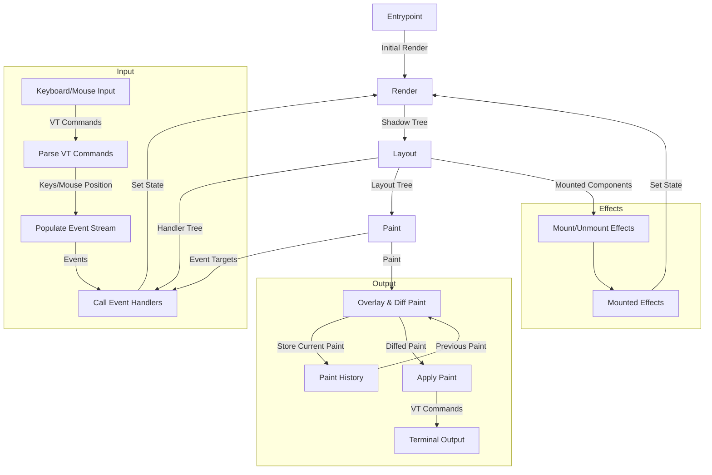

# Under the Hood

This section is for those who want to know more about how Counterweight's internals work.

## Inspirations

Counterweight is inspired by a variety of existing frameworks and libraries:

- [React](https://react.dev/) - state and side effect management via hooks, component tree,
  [declarative/immediate-mode UI](https://en.wikipedia.org/wiki/Immediate_mode_(computer_graphics))
- [Tailwind CSS](https://tailwindcss.com/) - utility styles on top of a granular CSS-like framework
- [Textual](https://textual.textualize.io/) - rendering to the terminal without going through something like
  [curses](https://docs.python.org/3/library/curses.html#module-curses), CSS-like styles

## Data Flow

